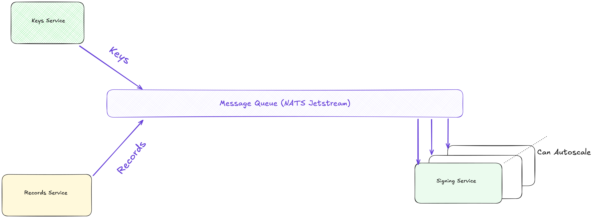

# 🔐 VaultStream

> **High-Performance Distributed Digital Signature System**  
> A microservices-based cryptographic infrastructure for secure record signing at scale, built with Go and event-driven architecture.


---

## ✨ Overview

VaultStream is a production-ready distributed system designed for high-throughput digital signature operations. It demonstrates enterprise-grade patterns including event-driven microservices, concurrent processing, and cryptographic best practices.

### 🎯 Key Features

- **🔑 ECDSA Cryptography** - P-256 curve key generation and digital signatures
- **⚡ High Concurrency** - Configurable goroutine pools with semaphore-based flow control
- **📊 Batch Processing** - Optimized bulk operations with chunking and parallel execution
- **🔄 Event-Driven Architecture** - NATS JetStream for reliable message delivery
- **🗄️ Resilient Data Layer** - PostgreSQL with Ent ORM and migration support
- **📈 Performance Tuning** - Configurable batch sizes and concurrency levels
- **🧪 Production Testing** - Integration tests with real database connections

## 🏗️ Architecture

### System Components

```
┌─────────────────┐    ┌──────────────────┐    ┌─────────────────┐
│   Keys Service  │    │  Records Service │    │ Signing Service │
│                 │    │                  │    │                 │
│ • ECDSA Key Gen │    │ • Batch Queries  │    │ • Concurrent    │
│ • Key Streaming │    │ • Record Publish │    │   Signing       │
│ • Concurrency   │────┤ • DB Integration │────┤ • Bulk Inserts  │
└─────────────────┘    └──────────────────┘    └─────────────────┘
         │                        │                        │
         └────────────────────────┼────────────────────────┘
                                  │
                    ┌─────────────▼──────────────┐
                    │      NATS JetStream       │
                    │   • Event Streaming       │
                    │   • Durable Consumers     │
                    │   • Message Persistence   │
                    └───────────────────────────┘
                                  │
                      ┌───────────▼────────────┐
                      │      PostgreSQL       │
                      │   • Records Table     │
                      │   • Signatures Table  │
                      │   • ACID Compliance   │
                      └───────────────────────┘
```



## 🚀 Quick Start

**One-command setup:**

```bash
make quick-start
```

This command will:

- ✅ Set up environment configuration
- ✅ Verify prerequisites (Go, Docker, Make)
- ✅ Launch PostgreSQL and NATS infrastructure
- ✅ Seed database with configurable record count
- ✅ Start all microservices concurrently

### 🎛️ Performance Tuning

Adjust these variables in the generated `.env` file to observe system behavior at different scales:

```bash
BATCH_SIZE=50              # Records per batch (impacts memory vs. throughput)
TOTAL_RECORDS=1000         # Scale of the signing workload
RECORDS_MAX_CONCURRENCY=10 # Parallel batch processing
SIGNER_MAX_CONCURRENCY=8   # Concurrent signature operations
```

## 🛠️ Tech Stack

| Category             | Technology     | Purpose                                 |
| -------------------- | -------------- | --------------------------------------- |
| **Language**         | Go 1.18+       | High-performance concurrent programming |
| **Message Broker**   | NATS JetStream | Event streaming with persistence        |
| **Database**         | PostgreSQL     | ACID-compliant data storage             |
| **ORM**              | Ent            | Type-safe database operations           |
| **Cryptography**     | ECDSA P-256    | Industry-standard digital signatures    |
| **Containerization** | Docker Compose | Local development infrastructure        |

## 📊 Data Model

### Database Tables

- **`records`** - Source data requiring digital signatures
- **`signatures`** - Cryptographic signatures with key associations

### Message Streams

- **`records.>`** - Batch record publishing for signature processing
- **`keys.>`** - Cryptographic key distribution and lifecycle management

## 🔧 Prerequisites

Ensure the following tools are installed:

| Tool       | Version | Installation                                                      |
| ---------- | ------- | ----------------------------------------------------------------- |
| **Go**     | 1.18+   | [golang.org/dl](https://golang.org/dl/)                           |
| **Docker** | 20.10+  | [docs.docker.com/get-docker](https://docs.docker.com/get-docker/) |
| **Make**   | Any     | Xcode CLI Tools (macOS) or package manager (Linux)                |

## 📋 Available Commands

```bash
make help          # Show all available commands
make quick-start   # Complete setup and launch
make start         # Launch services (after setup)
make test          # Run integration test suite
make stop          # Stop all services and cleanup
make clean         # Reset volumes and cached data
```

## 🔮 Roadmap

### Performance & Reliability

- [ ] **Retry Strategies** - Exponential backoff with jitter for transient failures
- [ ] **Circuit Breakers** - Fault tolerance for downstream dependencies
- [ ] **Metrics & Observability** - Prometheus metrics and distributed tracing

### Infrastructure & Deployment

- [ ] **Kubernetes Deployment** - Helm charts for container orchestration
- [ ] **Auto-scaling** - Horizontal pod autoscaling based on queue depth
- [ ] **Health Checks** - Comprehensive readiness and liveness probes

### Testing & Quality

- [ ] **Expanded Test Coverage** - Unit tests for critical cryptographic functions
- [ ] **Load Testing** - Performance benchmarks under high concurrency
- [ ] **Security Audit** - Formal review of cryptographic implementations

---

**🏢 Enterprise-Ready Features:** Structured logging • Graceful shutdowns • Database migrations • Configuration management • Error handling • Concurrent processing
